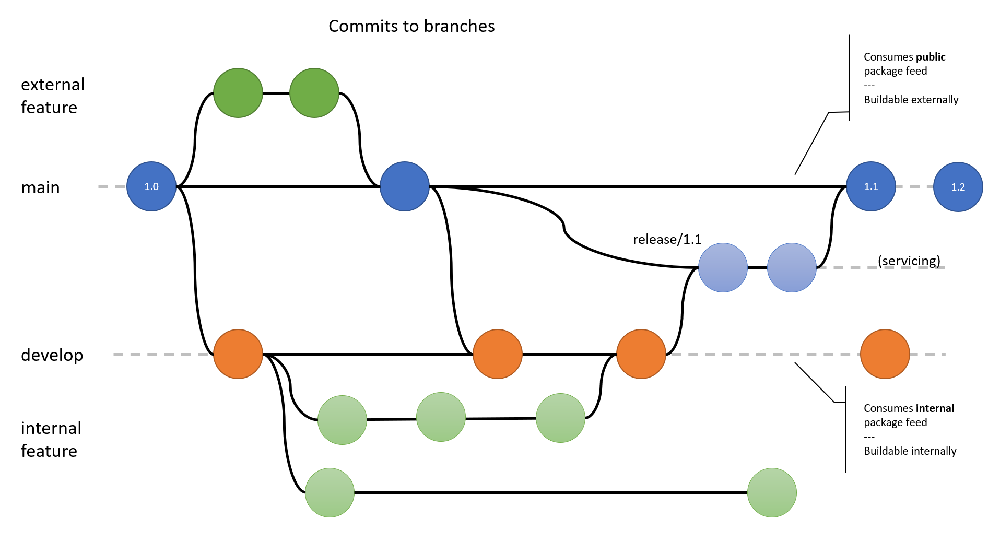

develop branch
===

Building the full Windows App SDK package involves multiple repos and build pipelines.
Beyond the publicly-visible repos, we also have closed-source repos that produce public packages which
are then consumed by this repo ([WindowsAppSDK](https://github.com/microsoft/WindowsAppSDK)).

Some of those packages can't yet be pushed to the public feed on a CI/nightly basis though.
Until that's resolved, we could get this repo into a state of being buildable only internally,
by restoring the latest package from an internal feed.

To allow either configuration to be built (using the public dependent package or the internal one),
we maintain two branches (similar to the GitFlow process):

* `main` branch consumes the latest public package
* `develop` branch consumes the latest internal package.

The `develop` branch code is in the repo and still open, but can only be built internally.
The `main` branch is always buildable at HEAD.
External contributions to the repo are made to the `main` branch,
and are merged internally into `develop` when completed.

Whenever a new public version of the dependent packages are pushed to the public feed,
the `develop` branch can be merged into `main`.
For example as part of (pre)releases.

Merging between `develop` and `main` is normal (not squashed),
so that both branches can show the correct history, just with a few extra merge commits.
Once the packages can be kept immediately updated we can drop the `develop` branch
and not lose any history.

The long-lasting difference between `main` and `develop` is the `nuget.config` file;
in `main` it references the public feed and in `develop` it references the internal feed.
Package references might be different too if `develop` branch is consuming a package that's
not yet on the public feed.

